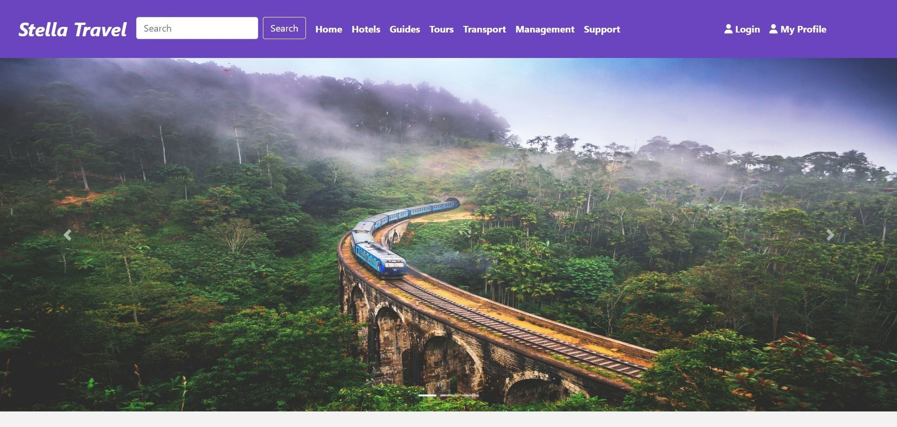
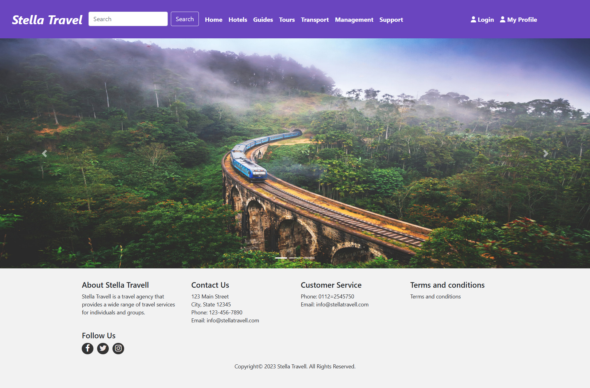
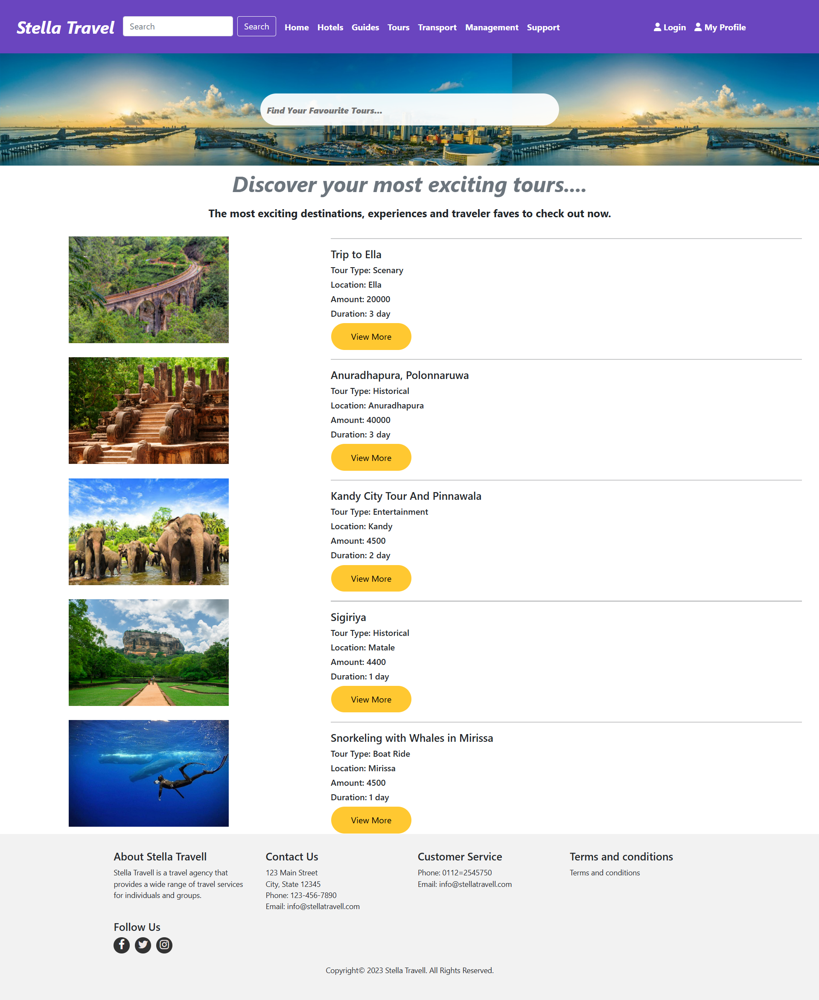
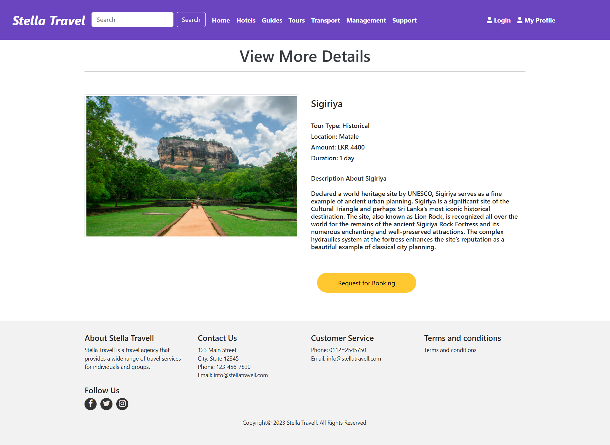
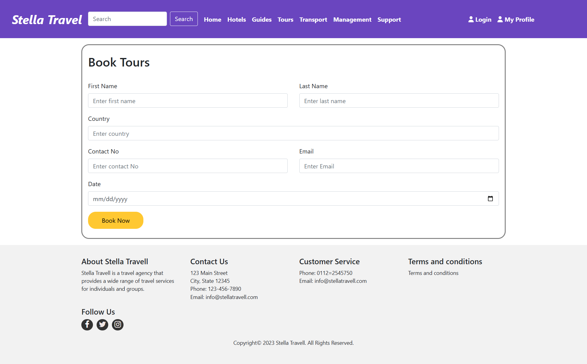
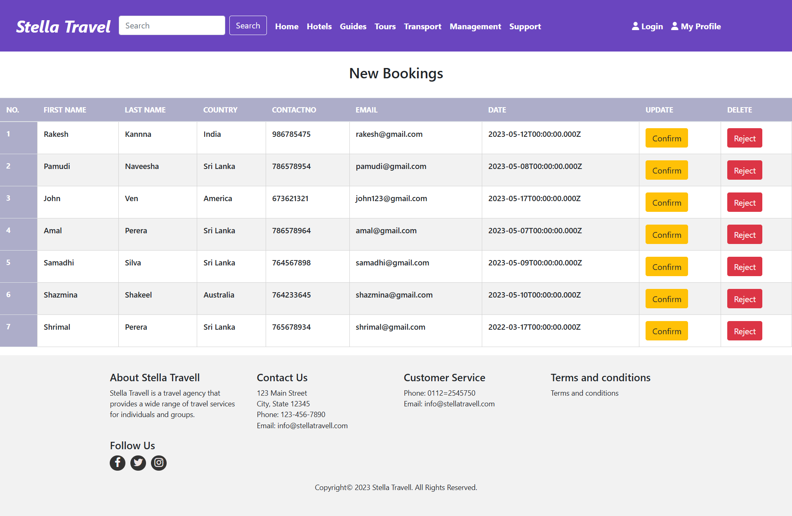
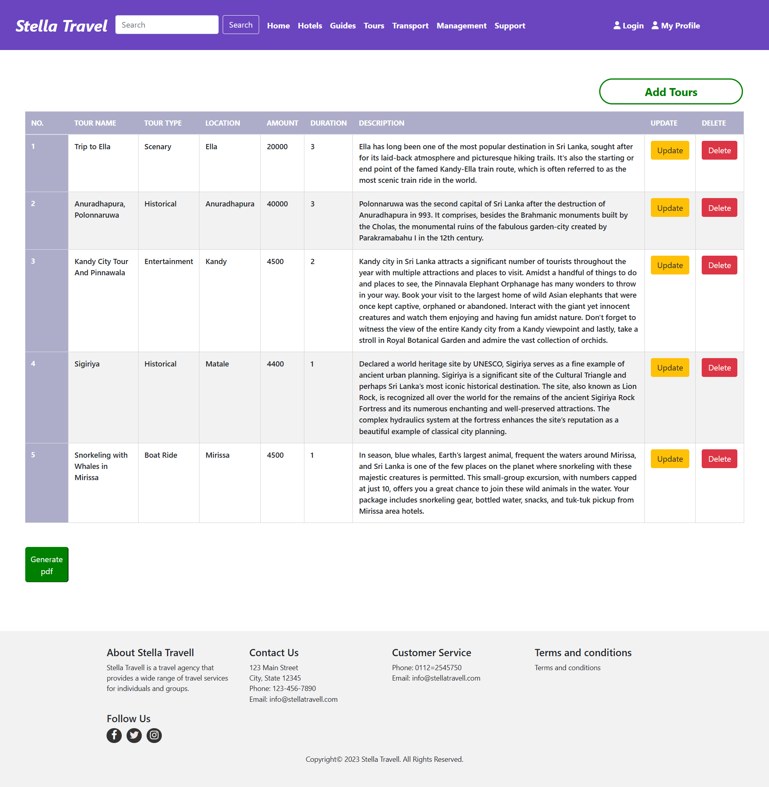
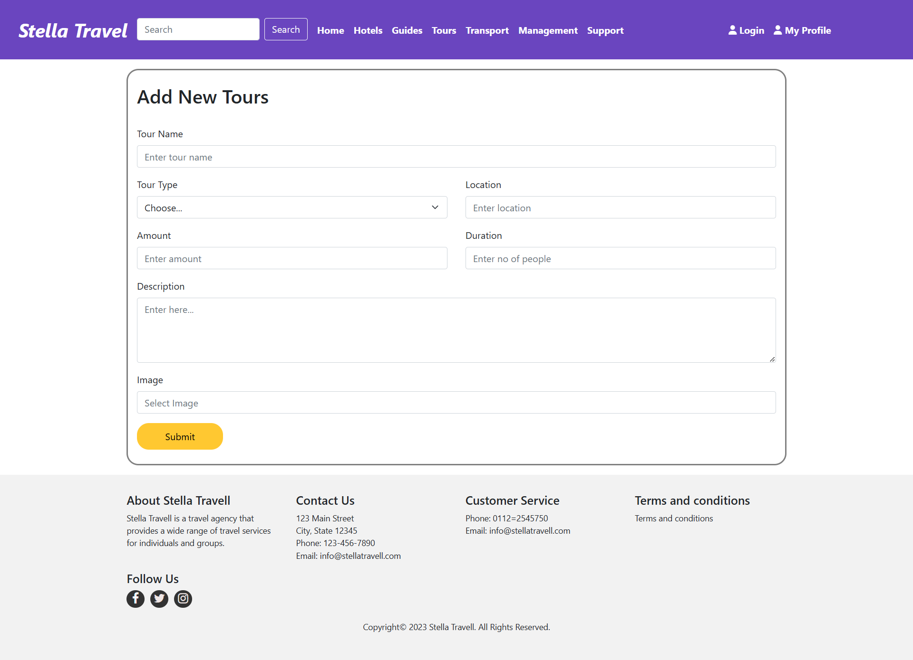
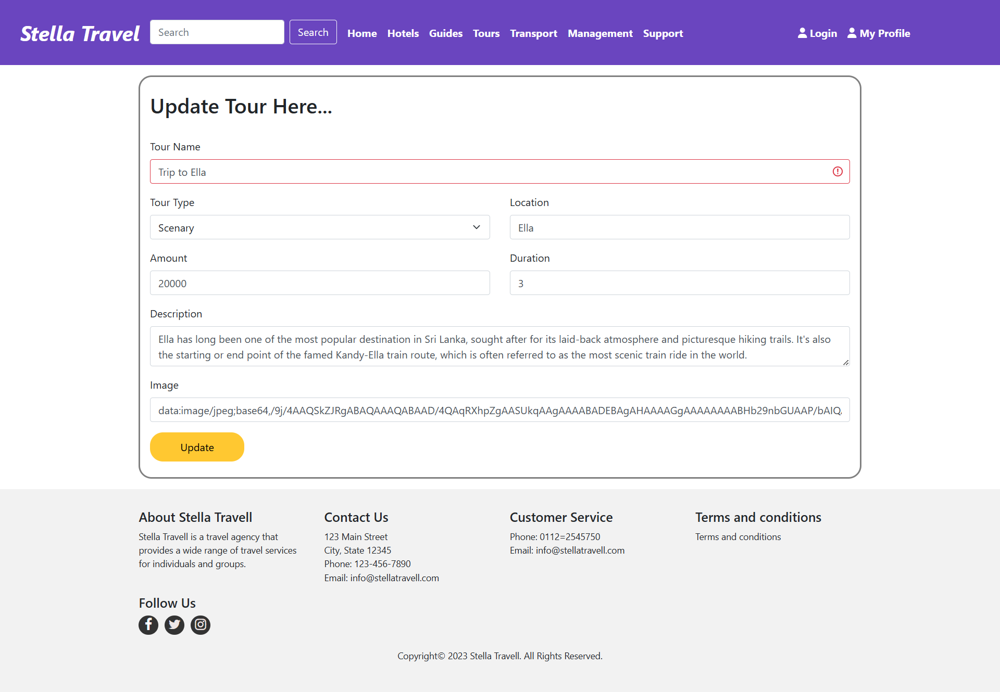
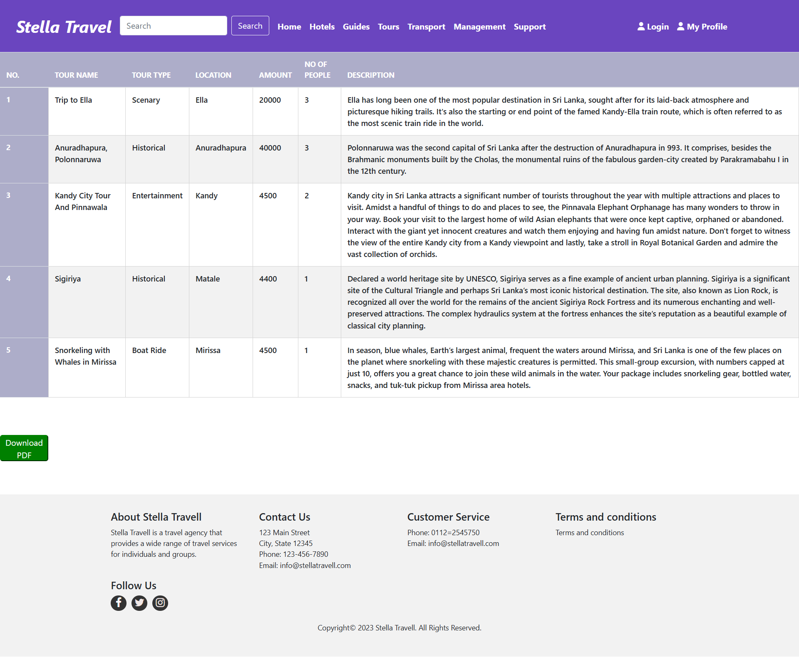

# Stella Travel Web Application

A brief description of your project goes here. Explain what the project does and its main features.

## Table of Contents

- [Project Interfaces](#project-interfaces)
- [Technologies Used](#technologies-used)
- [Prerequisites](#prerequisites)
- [Installation](#installation)
- [Set Up Environment Variables](#set-up-environment-variables)
- [Run the Project](#run-the-project)

## Project Interfaces

### Home page



### Tours page User View


### View More page


### Book Tours page


### New Bookings page Admin View


### Tours page Admin View


### Add New Tours page


### Update Tour page


### Generate Report page


## Technologies Used

- React.js
- Node.js
- Express.js
- MongoDB

## Prerequisites

Before you begin, ensure you have met the following requirements:

1. **Node.js**: [Download Node.js](https://nodejs.org/en/download/)
   - Node.js is required to run the backend and frontend of the application.

2. **npm**: Comes bundled with Node.js.

3. **MongoDB**: 
   - You can either install MongoDB locally or use MongoDB Atlas.
   - **Local Installation**: [Install MongoDB Community Edition](https://docs.mongodb.com/manual/installation/)
   - **MongoDB Atlas Setup**: [Getting Started with Atlas](https://docs.atlas.mongodb.com/getting-started/)

4. **Postman** (optional): Useful for testing API endpoints.
   - **Postman**: [Download Postman](https://www.postman.com/downloads/)

5. **Git**: [Download Git](https://git-scm.com/downloads)

## Installation

1. **Clone the repository:**

      ```bash
      git clone https://github.com/PamudiNaveesha/Stella-Travel-Web-Application.git
      cd Stella-Travel-Web-Application

2. **Install dependencies:**

#### For the backend

      ```bash
      cd BACKEND
      npm install

#### For the frontend

      ```bash
      cd frontend
      npm install

## Set Up Environment Variables

1. Open the `.env` file in the **BACKEND** folder of your project.
2. Add the following line to the file:
   
   ```plaintext
   MONGODB_URI=mongodb+srv://<username>:<password>@<clustername>.mongodb.net/<database>
   
4. **MONGODB_URI**: This is the key that your application will use to access the MongoDB database.
5. **MongoDB URI Format**: Replace `<username>`, `<password>`, `<clustername>`, and `<database>` with your actual MongoDB credentials and database name.
  
## Run the Project

#### Start the backend server

      ```bash
      cd BACKEND
      npm run dev

#### Start the frontend application

      ```bash
      cd frontend
      npm start 
